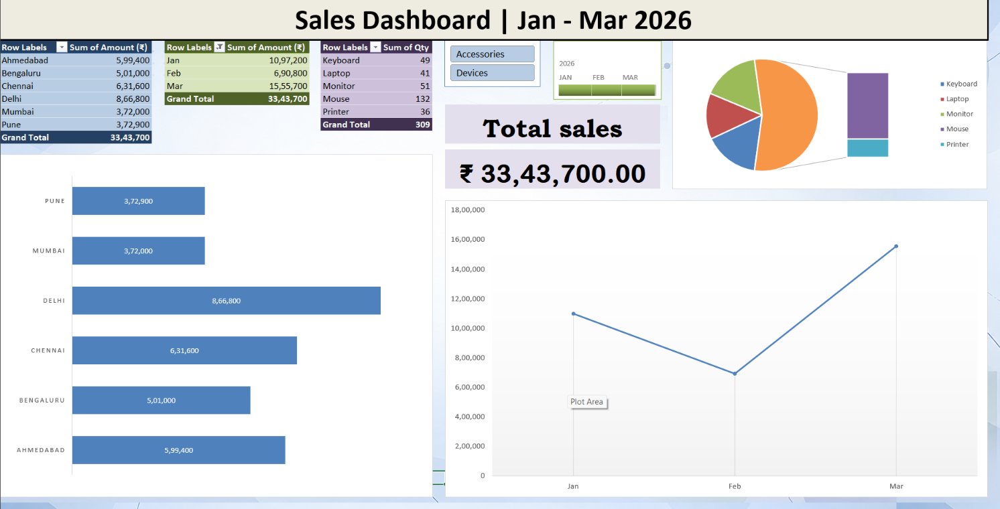

<h1 align="center">📊 Excel Sales Dashboard | Jan - Mar 2026</h1>

<p align="center">
  An interactive sales dashboard built in Microsoft Excel to analyse Q1 2026 sales by city, month and product.
</p>

<p align="center">
  
  
  
  
</p>

---

## 🎬 Demo

<p align="center">
  
</p>

<p align="center"><i>Using the Slicer and Timeline updates all pivot tables, charts and the KPI card together.</i></p>

---

## 🖼️ Dashboard Preview

<p align="center">
  
</p>

---

## 📌 Table of Contents

- [Project Overview](#-project-overview)
- [Key Insights](#-key-insights)
- [Dashboard Components](#-dashboard-components)
- [VBA Macro](#-vba-macro)
- [Project Structure](#-project-structure)
- [How to Use](#-how-to-use)
- [Skills Demonstrated](#-skills-demonstrated)
- [Future Improvements](#-future-improvements)
- [Author](#-author)

---

## 🧾 Project Overview

The goal of this project is to turn raw sales data into a clear, interactive one-page dashboard that answers three business questions:

1. **Which cities generate the most revenue?**
2. **How are sales trending month by month?**
3. **Which products sell the most units?**

The dashboard is fully interactive: a Slicer filters by product category and a Timeline filters by order date, with every pivot table, chart and KPI updating instantly.

---

## 💡 Key Insights

| Metric | Value |
|:--|:--|
| 💰 Total Sales | **₹33,43,700** |
| 📦 Total Quantity Sold | **309 units** |
| 🏙️ Top City | **Delhi** (₹8,66,800) |
| 📅 Best Month | **March** (₹15,55,700) |
| 🖱️ Top Product by Quantity | **Mouse** (132 units) |

- **Delhi** contributes about **26%** of total revenue, well ahead of every other city.
- Sales dipped in **February** (₹6,90,800) and then rose sharply in **March**, the strongest month of the quarter.
- **Mouse** is the highest-volume product, selling more units than Keyboard, Laptop, Monitor and Printer.

---

## 🧩 Dashboard Components

| Component | Type | Purpose |
|:--|:--|:--|
| Sales by City | Pivot Table + Bar Chart | Compare revenue across 6 cities |
| Sales by Month | Pivot Table + Line Chart | Track the monthly sales trend |
| Quantity by Product | Pivot Table + Pie Chart | Show product-wise unit share |
| Category Slicer | Slicer | Filter all pivots by Accessories / Devices |
| Order Date Timeline | Timeline | Filter all pivots by month |
| Total Sales Card | KPI Card | Show live total revenue linked to the pivot |

**Design choices:** custom title bar, gridlines removed, colour-coded pivot tables, and Indian number format (₹ with lakh-style commas).

---

## ⚙️ VBA Macro

The workbook includes a recorded macro, `FORMAT_HEADER`, that formats a header row (bold, fill colour, borders) in one click, so the same styling does not have to be applied by hand every time new data is added.

```vba
Sub FORMAT_HEADER()
    Range("A1:H1").Select
    Selection.Font.Bold = True
    With Selection.Interior
        .Pattern = xlSolid
        .PatternColorIndex = xlAutomatic
        .ThemeColor = xlThemeColorLight2
        .TintAndShade = 0.599993896298105
        .PatternTintAndShade = 0
    End With
    Selection.Borders.LineStyle = xlContinuous
End Sub
```

---

## 📁 Project Structure

```
excel-sales-dashboard/
├── Demo/
│   └── Excel_Interactive_Dashboard_Pivot_Slicer_Timeline.gif
├── Images/
│   └── Excel_Sales_Dashboard_Jan-Mar_2026.png
├── Excel_Practice_Workbook.xlsm
└── README.md
```

---

## 🚀 How to Use

1. Download [`Excel_Practice_Workbook.xlsm`](Excel_Practice_Workbook.xlsm).
2. Open it in Microsoft Excel (2013 or later) and click **Enable Content** when prompted, so the macro can run.
3. Go to the **Dashboard** sheet.
4. Use the **Category Slicer** and **Order Date Timeline** to filter the data.
5. To run the macro: **View → Macros → View Macros → FORMAT_HEADER → Run**.

> ⚠️ Macros are disabled by default in Excel. Only enable content for files from sources you trust.

---

## 🛠️ Skills Demonstrated

- Data summarisation with **Pivot Tables**
- Data visualisation with **Pivot Charts** (bar, line, pie)
- Interactive filtering with **Slicers** and **Timelines** (Report Connections)
- **KPI card** design linked to live pivot values
- **Dashboard layout and formatting**
- Task automation with **VBA macros**

---

## 🔮 Future Improvements

- Add more KPI cards (Total Quantity, Top City, Best Month)
- Add a **Refresh Dashboard** button powered by VBA
- Extend the data to a full year for quarter-on-quarter comparison
- Rebuild the dashboard in **Power BI** for a web-shareable version

---

## 👤 Author

**Aryan**

[](https://www.linkedin.com/in/faustus-aryan-b71978224)
[](https://github.com/faustusaryan)

<p align="center">⭐ If you found this project useful, consider giving it a star!</p>
